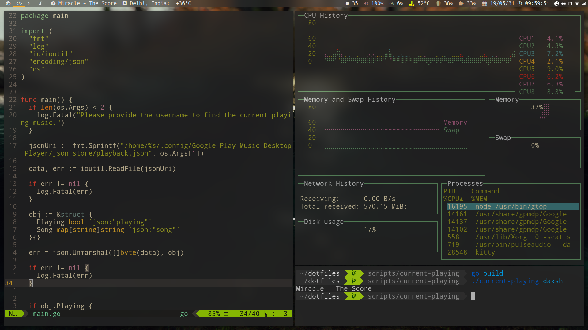

# Dotfiles
These are my dotfiles for my i3-gaps + polybar config.

**Wallpaper**: [The Elder Scrolls V: Skyrim Water Mod](https://wallhaven.cc/w/eyezdr)
**Shell**: Fish with Oh-My-Fish with bob-the-fish theme
**Color Scheme**: Gruvbox
**Dotfiles**: https://github.com/DakshMiglani/dotfiles
**Terminal**: Kitty
**Font**: Hack Nerd Font
**Bar**: Polybar
**Weather**: Script in dotfiles
**GPMDP (google play music)**: Script in dotfiles
**Blur**: Kawase blur, instructions in the i3 folder
**Symlinking**: Use GNU Stow
**Editor**: Neovim
**Browser**: Brave

Screenshot of the final look:

